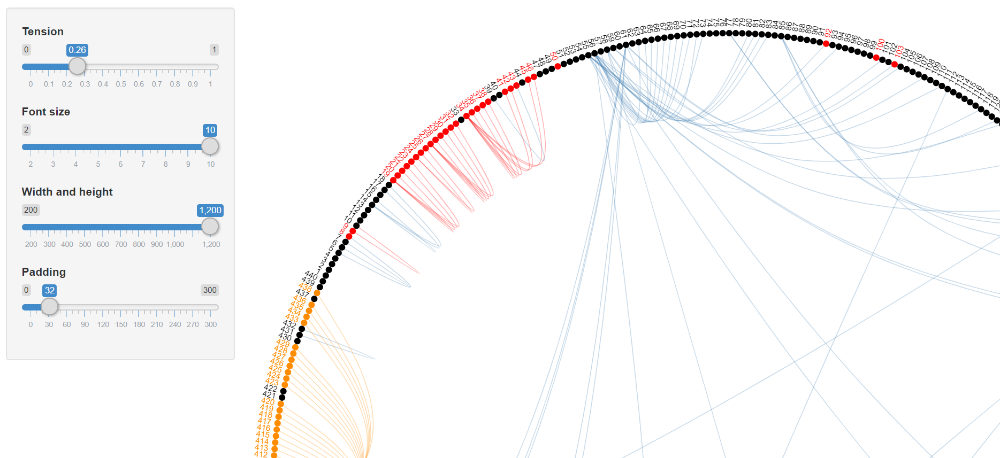

# shiny_web

## New Image!!
Follow [this](https://vivianchiou.github.io/shiny_web/img/plot_edgebundle.html) link for the interactive plot. A screenshot of the interface is provided below.

說明：Taiwan cases relationship plot

這是台灣個案關係圖，顯示著感染來源與相關病例，顏色說明分別為紅色：本土案例; 黑藍：境外移入; 橘黃：磐石軍艦

## TSDC TEAM A DEMO

- ## [**Shiny.io 展示**](https://tkustatdc.shinyapps.io/deepdataprogram_3rd_team_a_covid19/)

- ## [**Slide flipbookr 展示**](https://vivianchiou.github.io/shiny_web/slide_flipbookr.html)
  

- ## [**Slide revealjs 展示**](https://vivianchiou.github.io/shiny_web/slide_revealjs.html)

## do list
- [ ] add image
- [ ] add other data source (taiwan & glodal)
- [x] add **flipbookr** link to github
- [x] add **revealjs** link to github
- [x] add **shiny.app**
- [x] add 動動圖 to flipbookr
- [x] dashboard become better
- [x] pic
- [x] word to tsdc
- [x] md add pic 
